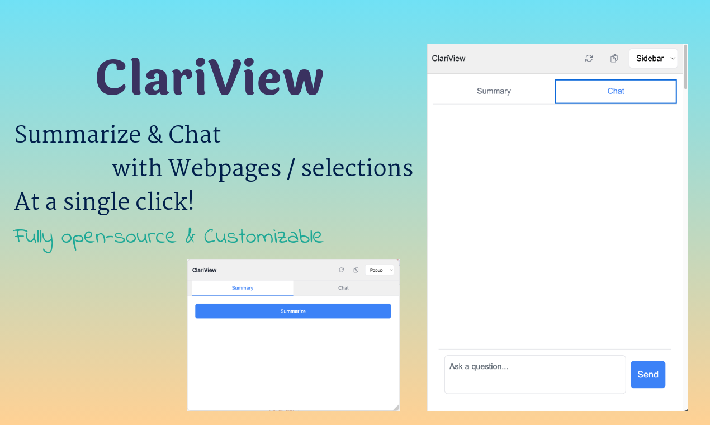

# ClariView

A fully customizable Chrome extension that helps summarize web pages or selected text using large language models.

## Features

- Summarize entire web pages or selected text
- Popup and sidebar display modes
- Draggable and resizable popup
- Collapsible sidebar with webpage margin adjustment
- Markdown rendering support
- Copy raw markdown
- Multiple language support
- Configurable AI models and settings

## File Structure

### manifest.json
- Extension configuration file
- Defines permissions, content scripts, and resources
- Add new permissions or resources here
- Configure extension metadata

### background.js
- Handles extension icon clicks
- Manages context menu for text selection
- Add background processes or global event handlers here

### content-script.js
- Main functionality for popup and sidebar
- Handles UI creation and interaction
- Contains API calls to OpenAI
- Modify core functionality here:
  - Popup/sidebar creation and behavior
  - Drag and resize functionality
  - Summary generation
  - Display mode switching
  - Copy and retry features

### content-styles.css
- Styles for popup and sidebar
- Markdown rendering styles
- Modify appearance and layout here:
  - Dimensions and positioning
  - Colors and themes
  - Animations and transitions
  - Responsive design

### options.html
- Settings page UI
- Configure extension options
- Add new settings or configuration options here

### options.js
- Handles settings management
- Saves/loads user preferences
- Add new settings functionality here:
  - Default values
  - Settings validation
  - Storage management

### marked.min.js
- Markdown parsing library
- Used for rendering markdown content
- Third-party library, don't modify

## Common Modifications

### Adding a New Feature
1. Add necessary permissions in `manifest.json`
2. Add UI elements in `content-script.js`
3. Add styles in `content-styles.css`
4. Add settings in `options.html` and `options.js` if needed

### Modifying Appearance
- Edit `content-styles.css` for popup/sidebar styles
- Adjust dimensions, colors, and layouts

### Changing Behavior
- Edit `content-script.js` for core functionality
- Modify event handlers and API calls
- Update UI creation and management

### Adding Settings
1. Add form elements in `options.html`
2. Add default values in `options.js`
3. Update storage handling in `options.js`
4. Use settings in `content-script.js`

### Adding Context Menu Items
- Modify `background.js` to add new menu items
- Add corresponding handlers in `content-script.js`

## API Integration
- OpenAI API calls are in `content-script.js`
- Model configuration in `options.html`
- API key management in `options.js`

## Storage
- Chrome storage sync used for settings
- Managed in `options.js`
- Accessed in `content-script.js`

## Events
- Extension icon click: `background.js`
- Context menu: `background.js`
- UI interactions: `content-script.js`
- Settings changes: `options.js` 